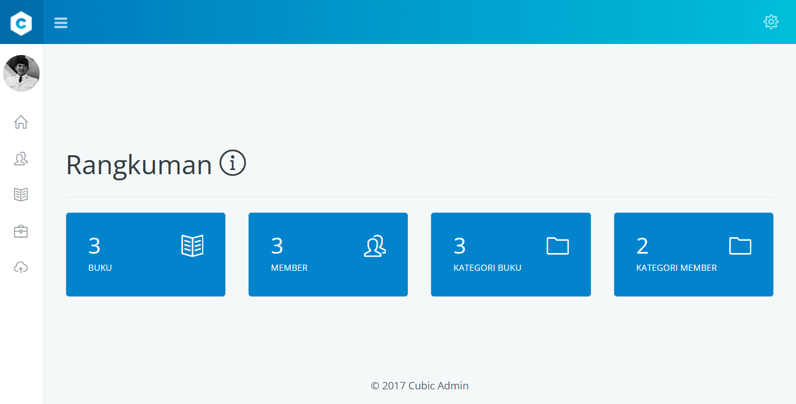
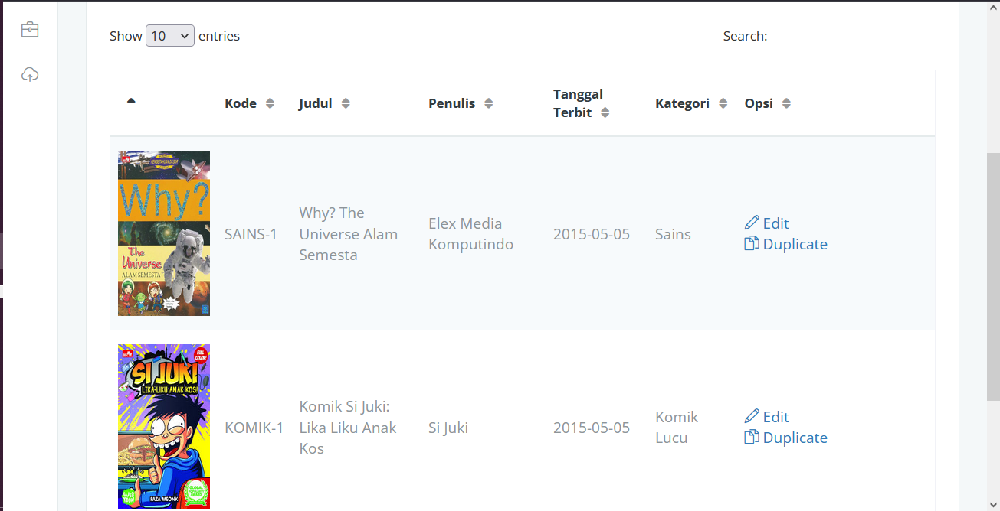
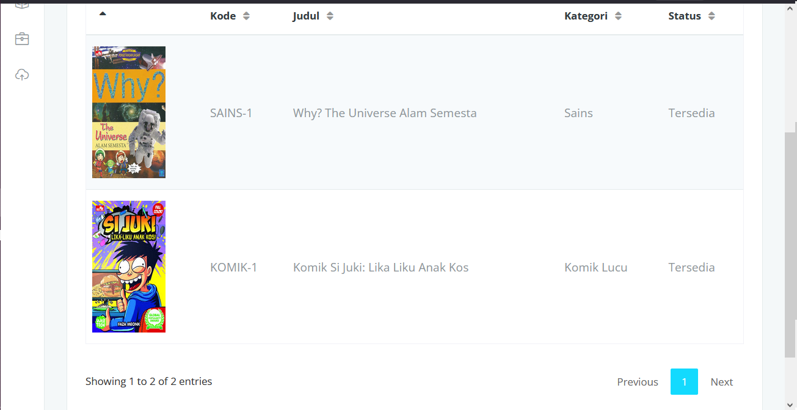
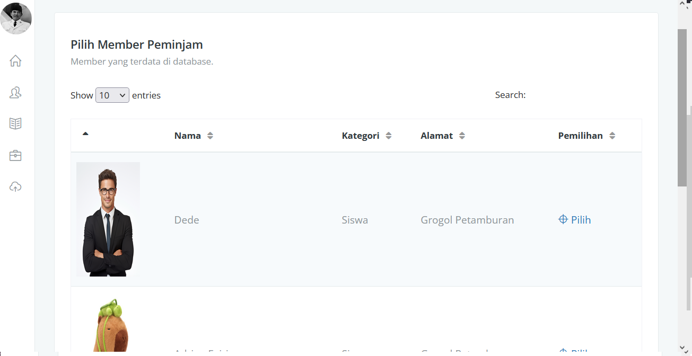
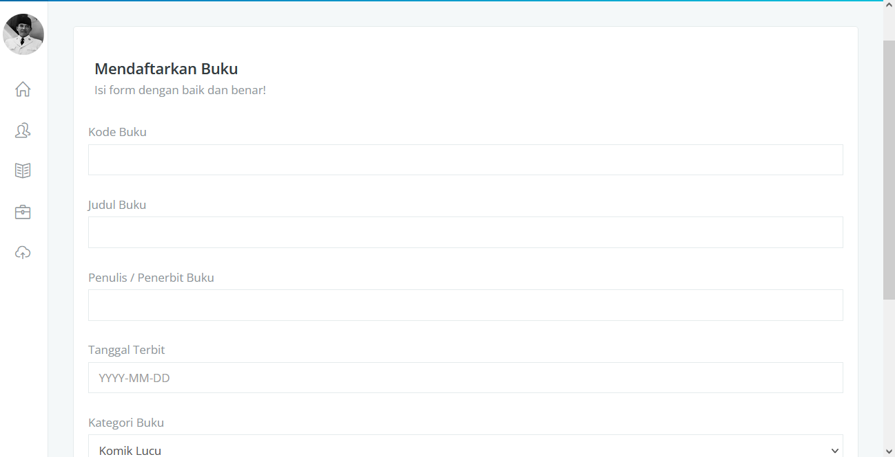
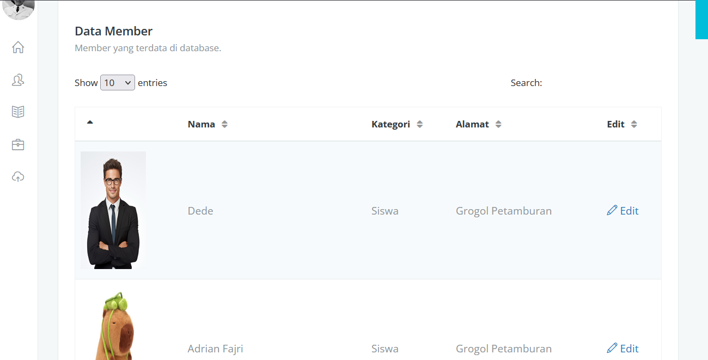

# Perpustakaan Merdeka 📚

SDN 1 Wangunjaya memiliki masalah dimana pencatatan perpustakaan sekolah masih dilakukan secara manual. Dengan aplikasi berbasis PHP ini, sekolah dapat melakukan pencatatan secara digital dengan instalasi mudah dan tanpa internet (offline) maupun hosting (online). Aplikasi dibangun sepenuhnya dengan Native PHP dan Javascript.

# Screenshots
### Tampilan Utama

### Tampilan "Index Book"

### Tampilan "Lend Book"

### Tampilan "Add Book"

### Tampilan "Member"

